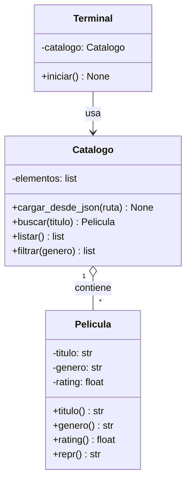

# Diagrama de clases

> Actualizado en TP1 con la implementación de la v1.

```mermaid
classDiagram
    class Pelicula {
        -titulo: str
        -genero: str
        -rating: float
        +titulo() str
        +genero() str
        +rating() float
        +repr() str
    }
    class Catalogo {
        -elementos: list
        +cargar_desde_json(ruta) None
        +buscar(titulo) Pelicula
        +listar() list
        +filtrar(genero) list
    }
    class Terminal {
        -catalogo: Catalogo
        +iniciar() None
    }
    Terminal --> Catalogo : usa
    Catalogo "1" o-- "*" Pelicula : contiene
```
